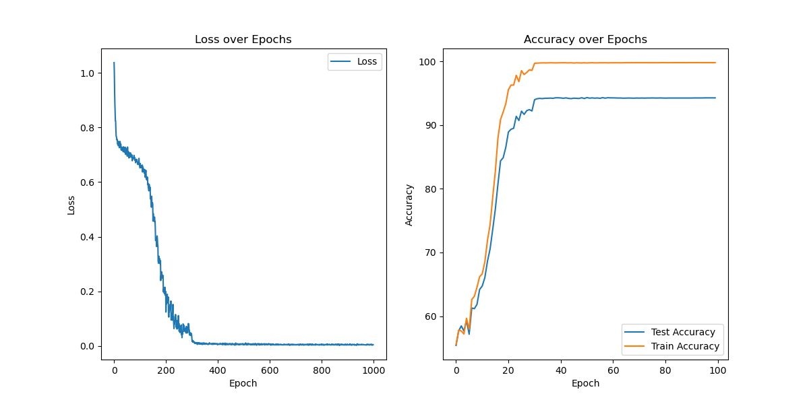
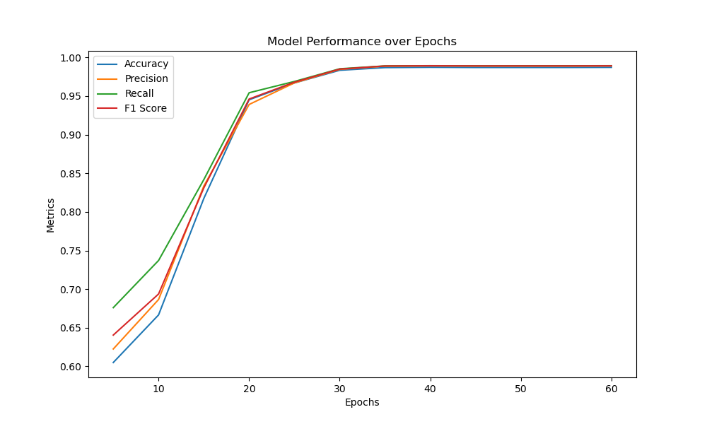

# CancerDetectNet

CancerDetectNet is a mammogram classifier built with PyTorch. The model uses a Convolutional Neural Network to determine whether a given mammogram image shows normal breast tissue, a malignant mass, or a benign mass. The model is quite accurate, and was trained using over 16,000 unique images pulled from various online sources.

## Table of Contents
- [Introduction](#introduction)
- [Results](#results)
- [Technical Details](#technical-details)

## Introduction
The concept of using Neural Networks in the medical field is nothing new. The idea is actually quite popular, because [gaining knowledge and actionable insights from complex data remains a key challenge in transforming health care.](https://www.ncbi.nlm.nih.gov/pmc/articles/PMC6455466/) The importance of early and accurate breast cancer detection can not be understated, as breast cancer is the [second leading cause of death among women globally.](https://www.cdc.gov/cancer/breast/basic_info/index.htm#:~:text=Except%20for%20skin%20cancer%2C%20breast,cancer%20death%20among%20Hispanic%20women.) This project aims to tackle the classification of mammogram images taken by x-ray machines, and classify them into their respective categories. The categories are Malignant, Benign, and Normal. The model was trained on the images from the [CBIS Dataset](https://www.kaggle.com/datasets/awsaf49/cbis-ddsm-breast-cancer-image-dataset), the [INbreast Dataset](https://www.kaggle.com/datasets/ramanathansp20/inbreast-dataset), and the [MIAS Dataset](https://www.kaggle.com/datasets/kmader/mias-mammography).

## Results

The above image shows the plot of the loss of the model over 100 training epochs. The model converged quite quickly, which is typical when using such a large dataset to train on. Below you will also see some more metrics for the model as it was tested throughout it's training. 
 

The fully trained model's accuracy on the unseen test set was an impressive 94.2%, correctly classifying and diagnosing about 19 out of every 20 mammograms.

## Technical Details
The models architecture consisted of 2 Convolutional Layers, 2 Max Pooling Layers, and 2 Fully Connected Layers. The model took 1.5 hours to train on an NVIDIA 4080. Below is an image of the architecture.
[Image Here]()
