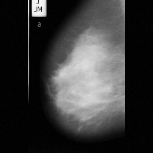
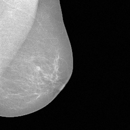
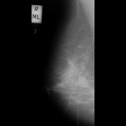
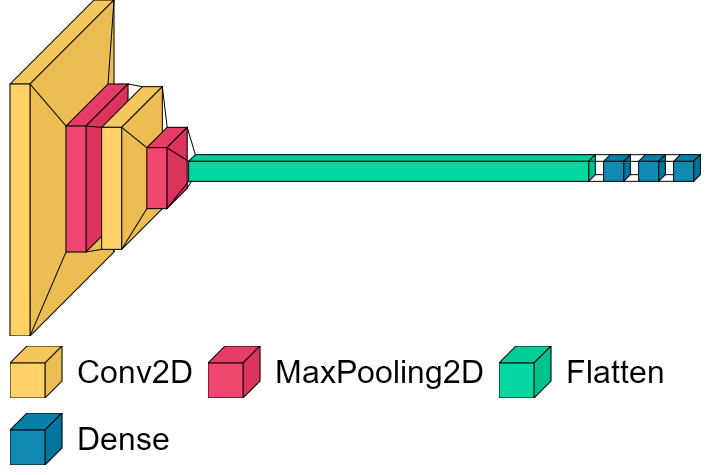

# CancerDetectNet

CancerDetectNet is a mammogram classifier built with PyTorch. The model uses a Convolutional Neural Network to determine whether a given mammogram image shows normal breast tissue, a malignant mass, or a benign mass. The model is quite accurate, and was trained using over 16,000 unique images pulled from various online sources.

## Table of Contents
- [Introduction](#introduction)
- [Implementation](#implementation)
- [Results](#results)
- [Installation](#installation)
- [Technical Details](#technical-details)
- [Citations](#citations)
- [Next Steps](#next-steps)

## Introduction
The concept of using Neural Networks in the medical field is nothing new. The idea is actually quite popular, because [gaining knowledge and actionable insights from complex data remains a key challenge in transforming health care.](https://www.ncbi.nlm.nih.gov/pmc/articles/PMC6455466/) The importance of early and accurate breast cancer detection can not be understated, as breast cancer is the [second leading cause of death among women globally.](https://www.cdc.gov/cancer/breast/basic_info/index.htm#:~:text=Except%20for%20skin%20cancer%2C%20breast,cancer%20death%20among%20Hispanic%20women.) This project aims to tackle the classification of mammogram images taken by x-ray machines, and classify them into their respective categories. The categories are Malignant, Benign, and Normal. The model was trained on the images from the [CBIS Dataset](https://www.kaggle.com/datasets/awsaf49/cbis-ddsm-breast-cancer-image-dataset), the [INbreast Dataset](https://www.kaggle.com/datasets/ramanathansp20/inbreast-dataset), and the [MIAS Dataset](https://www.kaggle.com/datasets/kmader/mias-mammography).  
 

 
*Examples of Training Images*

## Implementation
CancerDetectNet was developed using Python 3.10 and PyTorch. The model's training and validation were performed using datasets from CBIS, INbreast, and MIAS, among others, to ensure comprehensive learning and accuracy.

## Results
The model achieved a remarkable accuracy of 94.2% on a validation set of approximately 5,000 unseen images, effectively diagnosing 19 out of every 20 mammograms.
- Training Time: 1.5 hours on an NVIDIA 4080 GPU
- Training Epochs: 100
- Final Accuracy: 94.2%

*Training Loss and Accuracy Over Time*

*Model Evaluation*

## Installation

## Technical Details
The model's architecture includes:
- 2 Convolutional Layers
- 2 Max Pooling Layers
- 2 Fully Connected Layers
Training was conducted on an NVIDIA 4080 GPU, taking approximately 1.5 hours to complete.

   *Model Architecture*

## Citations
- <strong>Datasets</strong>
  - [CBIS Dataset](https://www.kaggle.com/datasets/awsaf49/cbis-ddsm-breast-cancer-image-dataset)
  - [INbreast Dataset](https://www.kaggle.com/datasets/ramanathansp20/inbreast-dataset)
  - [MIAS Dataset](https://www.kaggle.com/datasets/kmader/mias-mammography)
- <strong>Papers</strong>
  - [Breast Cancer Mammograms Classification Using Deep Neural Network and Entropy-Controlled Whale Optimization Algorithm](https://www.mdpi.com/2075-4418/12/2/557)

## Next Steps  
- Update README with detailed project information and user guides.
- Provide comprehensive installation and setup instructions for local execution.
